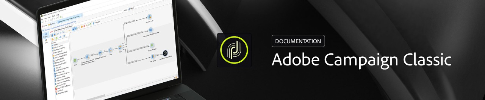

# Help Center {#control-panel-documentation}

 

## About Control Panel {#about-control-panel}

Control Panel helps you increase efficiency in your work as a product admin of Adobe Campaign Standard and/or Classic, by allowing you to manage settings and track usages for each of your instances. Its intuitive interface lets you easily monitor usage of key assets, as well as perform administrative tasks such as IP addresses whitelisting, SFTP storage monitoring, key management, and more.

Key benefits:

* Quickly make changes to settings by yourself without reaching out to Customer Care.
* Configure settings based on your different business needs at different times.
* Enhance security by controlling access settings on a need-by-need basis.

>[!NOTE]
>The Control Panel is accessible to Admin users only, and available for all customers hosted on AWS. The steps to grant Admin access to a user are detailed in [this section](discover/using/managing-permissions.md). To check if your instance is hosted on AWS, follow the steps detailed in [this section](faq.md).
>
>Please note that upgrading to the latest Campaign build is not required to access the Control Panel.

<table>
<tr>
    <td></td>
    <td>
        
<a href="discover/using/accessing-control-panel.md"><strong>Discover Control Panel</strong></a>

        <em>Learn more on Control Panel and how to access it.</em>
    </td>
    <td></td>
    <td>
        
<a href="sftp/using/about-sftp-management.md"><strong>Monitor your SFTP servers</strong></a>

        <em>Learn more on how to manage your SFTP servers.</em>
    </td>
</tr>
<tr>
    <td></td>
    <td>
        
<a href="subdomains-certificates/using/about-ssl-certificates.md"><strong>Monitor your subdomains</strong></a>

        <em>Learn more on how to monitor your subdomains and their certificates.</em>
    </td>
    <td></td>
    <td>
        
<a href="instances-settings/using/instance-details.md"><strong>Manage your instance settings</strong></a>

        <em>Learn more on how to manage your instances settings (Campaign Classic only)</em>
    </td>
</tr>
</table>

## Additional Resources {#additional-resources}

* Control Panel tutorial videos for [Campaign Standard)](https://docs.adobe.com/content/help/en/campaign-learn/campaign-standard-tutorials/administrating/control-panel/control-panel-overview.html) and [Campaign Classic](https://docs.adobe.com/content/help/en/campaign-learn/campaign-classic-tutorials/administrating/control-panel-acc/control-panel-overview.html)
* [Campaign Standard product documentation](https://docs.adobe.com/content/help/en/campaign-standard/using/campaign-standard-home.html)
* [Campaign Classic product documentation](https://docs.adobe.com/content/help/en/campaign-classic/using/campaign-classic-home.html)
