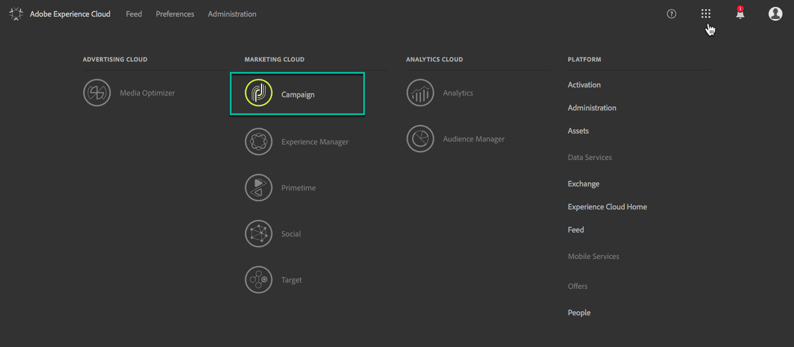
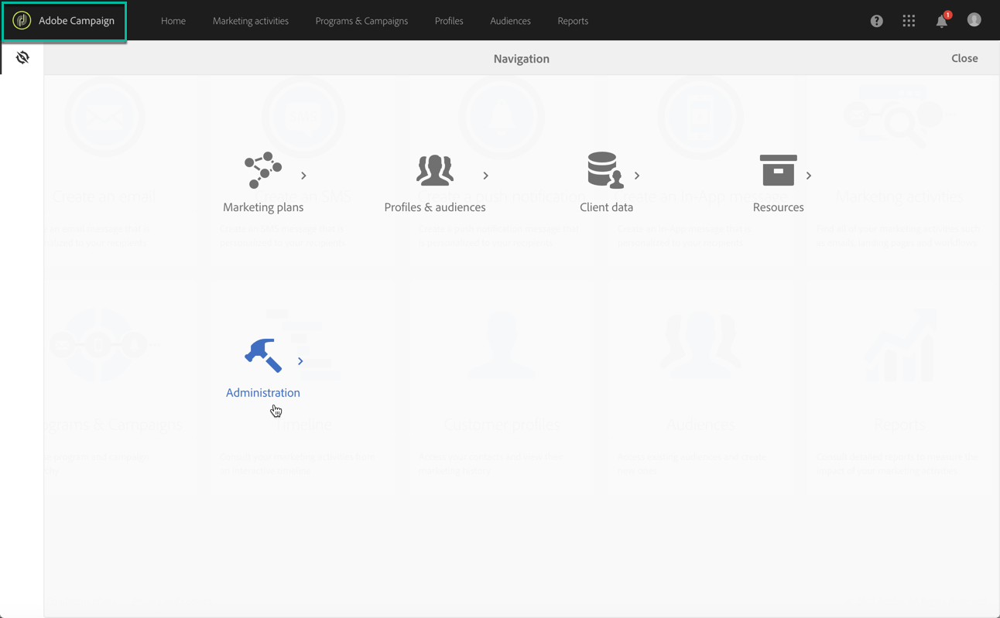

# Accessing Control Panel {#accessing-control-panel}

>[!NOTE]
>The Control Panel is available to Admin users only. For more on how to assign users to the Administrators group, refer to [this section](../../discover/using/managing-permissions.md).

The Campaign Control Panel is accessible directly from the Experience Cloud, or from the product itself.

## Access from the Experience Cloud Platform {#access-experience-cloud-platform}

To access the Control Panel from the Experience Cloud Platform,  navigate to the [Experience Cloud Platform homepage](https://amc.experiencecloud.adobe.com/), then click the dedicated link in the **Quick Access** section.

The Control Panel is also accessible from the Experience Cloud Platform **solution picker**:

1. Navigate to the [Adobe Experience Cloud](https://amc.experiencecloud.adobe.com/), then select **Campaign** from the solution picker.

    

1. The list of your Campaign instances displays. Click the **Control Panel** card to launch it.

    

## Access from the product {#access-product}

>[!NOTE]
>
>For **Campaign Classic** instances, access from within the product is available from Campaign Classic 19.1 version onwards.

1. Open your Campaign Standard product, then select the **[!UICONTROL Administration]** menu from the **[!UICONTROL Navigation]** pane.

    

1. Click the Control Panel icon to launch it.

    
