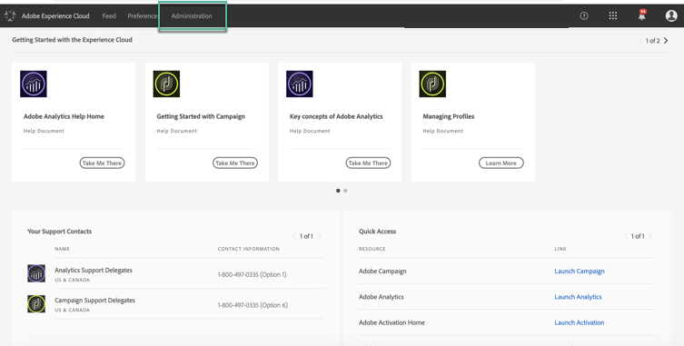
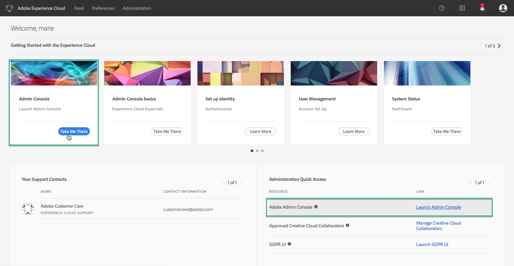
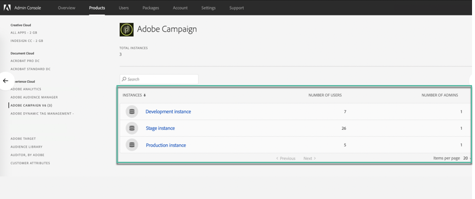
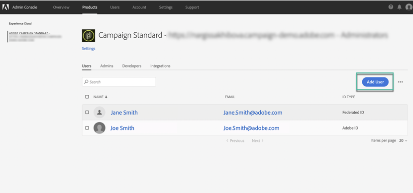

# Managing permsissions to Control Panel {#managing-permissions-control-panel}

The Control Panel is available to all Admin users of a Campaign instance. Follow the steps below to assign users to Administrators group and grant them an access to the Control Panel.

1. Navigate to the [Adobe Experience Cloud](https://amc.experiencecloud.adobe.com/exc-content/login.html), then select the **[!UICONTROL Administration]** tab.

    >[!NOTE]
    >
    >If the Administration tab is not visible, this means that you don't have Admin rights for your organization. Contact your Organization Administrators to complete the steps with them.

    

1. Launch the **Admin Console** by clicking on the available links.

    

1. Select the desired Campaign product.

    

    >[!NOTE]
    >
    >If you do not see your product, contact your Organization Administrators so that they give you access to it.

1. The list of instances for your Campaign product displays. Select the instance to which you want to add an Admin user.

    

    >[!NOTE]
    >
    >You can add different Admin users for each Campaign instance. In that case, Admin users will access the Control Panel of the instance to which they belong only.

1. The list of Product Profiles for the selected instance displays. Click the **[!UICONTROL Administrators]** product profile to access the list of Admin users.

    >[!NOTE]
    >
    >By default, Admin users belong to the "Administrators" Product Profile. According to your organization configuration, the Product Profile can be named differentely ("admin", "admins", ...).

    

1. The list of Admin users displays. Click the **[!UICONTROL Add User]** button to add a new user.

    
