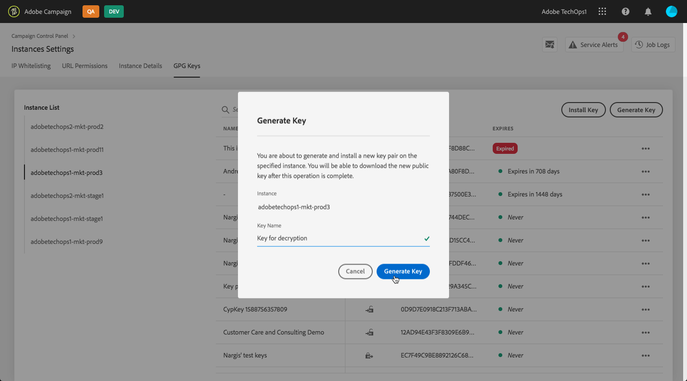

# GPG keys management {#gpg-keys-management}

>[!IMPORTANT]
>
>This feature is available for Campaign Classic instances only.

## About GPG encryption {about-gpg-encryption}

GPG encryption allows you to protect your data using a system of public-private keys pairs. Once implemented, you can decrypt incoming data and encrypt your data before transfer occurs, to ensure that they will not be accessed by anyone without a valid matching key pair.

To implement GPG encryption with Campaign, GPG keys must be installed on a marketing instance by an Administrator user directly from the Control Panel.

You will then be able to:

* **Encrypt sent data**: Campaign Classic sends data out, and encrypts them with the installed public key.

* **Decrypt incoming data**: Campaign Classic receives data that has been encrypted from an outside system using a public key shared by the Control Panel. Campaign Classic decrypts the data using a private key that is generated from the Control Panel.

## Monitoring GPG keys

To access GPG keys installed and generated for your instances, open the **[!UICONTROL Instance settings]** card, then select the **[!UICONTROL GPG keys]** tab.

The list displays all encryption and decryption GPG keys that have been installed and generated for your instances with detailed information on each key:

* **[!UICONTROL Name]**: The name that has been defined when installing or generating the key.
* **[!UICONTROL Use case]**: This column specifies if the key has been installed for data encryption, or generated to allow data decrypt ion.
* **[!UICONTROL Fingerprint]**: the fingerprint of the key.
* **[!UICONTROL Expires]**: The key's expiration date. Note that Control Panel will notifies you 30 days, then 10 days before a key expires.

As a best practice, we recommend that you remove any key that you do not need anymore. To do this, click the **...** button then select **[!UICONTROL Delete Key].**.

>[!IMPORTANT]
>
>Before removing a key, make sure that it is not used in any Campaign Classic workflow to prevent them from failing.

## Encrypting data {#encrypting-data}

Control Panel allows you to encrypt data coming out from your Campaign Classic instance.

To do this, you need to generate a GPG key pair, then install the generated public key into Control Panel. To do this, follow these steps:

1. Generate a GPG public/private key pair using a PGP encryption tool.

    In order to identify the public key easily when using it in Campaign, include a comment in the key's UID field with the name of your choice. In the example below, the public key will be identified with the "Public key for encryption" name.

    

1. Access the **[!UICONTROL GPG Keys]** tab, then select the instance on which you want to install the public key.
1. Click the **[!UICONTROL Install Key]** button.

    

1. Paste the public key that has been generated from your PGP encryption tool, then click the **!UICONTROL Install Key]** button. You can also directly drag and drop the public key file.

    >[!NOTE]
    >
    >The public key should be in the OpenPGP format and begin with the `-----BEGIN PGP PUBLIC KEY BLOCK-----`syntax.

    

key becomes available for use in extract file workflow activity. It is identified by the label of the key enteed in control panel

- use key in extract file activity

## Decrypting data {#decrypting-data}

- generate a GPG key through the control panel

generate: (to decrypt data)
            - click generate key button
            - type name
            - expiraty date (or never expire)
            - generate key
            - once key generated, green pop-up : Download Key OR click … button / download

- use the key in load file activity
