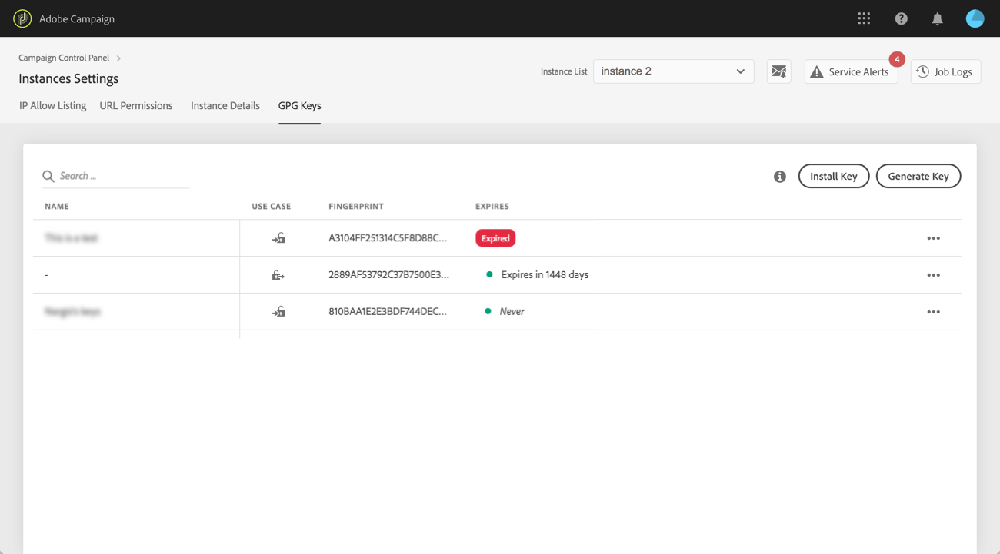
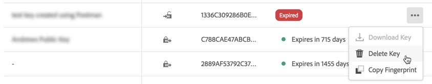
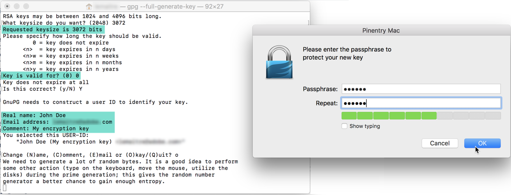
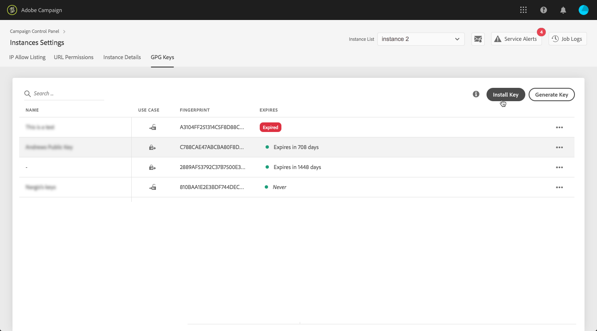
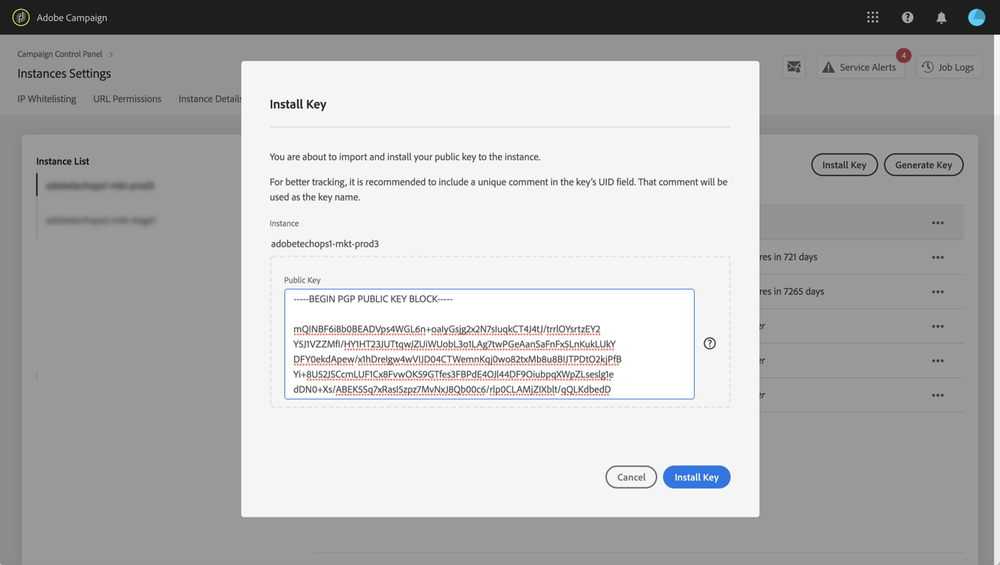
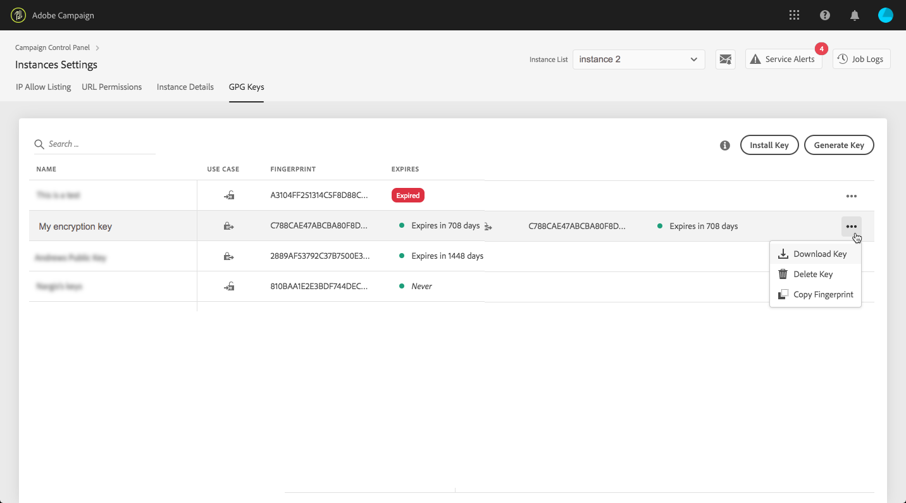
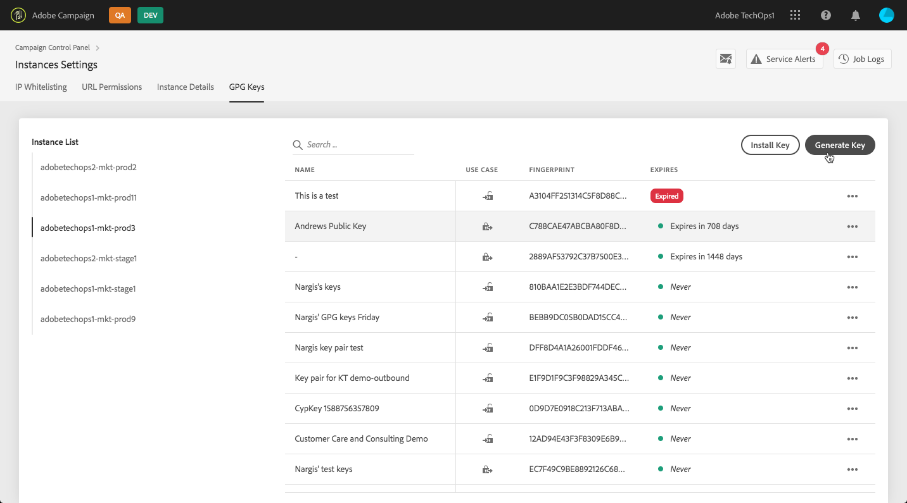
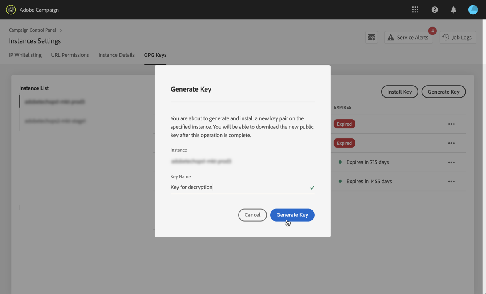
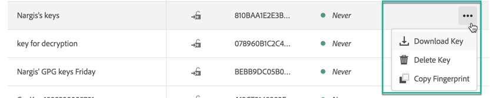

# GPG keys management {#gpg-keys-management}

## About GPG encryption {about-gpg-encryption}

GPG encryption allows you to protect your data using a system of public-private keys pairs. Once implemented, you can decrypt incoming data and encrypt your data before transfer occurs, to ensure that they will not be accessed by anyone without a valid matching key pair.

To implement GPG encryption with Campaign, GPG keys must be installed on a marketing instance by an Administrator user directly from the Control Panel.

You will then be able to:

* **Encrypt sent data**: Adobe Campaign sends data out, and encrypts them with the installed public key.

* **Decrypt incoming data**: Adobe Campaign receives data that has been encrypted from an outside system using a public key shared by the Control Panel. Adobe Campaign decrypts the data using a private key that is generated from the Control Panel.

## Monitoring GPG keys

To access GPG keys installed and generated for your instances, open the **[!UICONTROL Instance settings]** card, then select the **[!UICONTROL GPG keys]** tab.

The list displays all encryption and decryption GPG keys that have been installed and generated for your instances with detailed information on each key:

* **[!UICONTROL Name]**: The name that has been defined when installing or generating the key.
* **[!UICONTROL Use case]**: This column specifies if the key has been installed for data encryption, or generated to allow data decrypt ion.
* **[!UICONTROL Fingerprint]**: the fingerprint of the key.

As a best practice, we recommend that you remove any key that you do not need anymore. To do this, click the **...** button then select **[!UICONTROL Delete Key].**.

>[!IMPORTANT]
>
>Before removing a key, make sure that it is not used in any Adobe Campaign workflow to prevent them from failing.

## Encrypting data {#encrypting-data}

Control Panel allows you to encrypt data coming out from your Adobe Campaign instance.

To do this, you need to generate a GPG key pair from a PGP encryption tool, then install the public key into Control Panel. You will then be able to encrypt data before sending it from you instance. To do this, follow these steps:

1. Generate a GPG public/private key pair using a PGP encryption tool. To do this, install a PGP utility or GNuPG software.

    >[!NOTE]
    >
    >Open source free sotware to generate keys is available. However, make sure you follow the guidelines of your organization and use the PGP utility recommended by your IT/Security organization.

1. Once the utility is installed, run the command below, in Mac Terminal or Wndows Machine.

    `gpg --full-generate-key`

1. When prompted, specify the desired parameters for your key. Required parameters are:

    * **key type** (RSA)
    * **key length**
    * **real name**
    * **comment** (adding a label in the comment field allows you to identify the key easily in Control Panel).
    * **email**
    * **expiration** (date or "0" for no expiration date)
    * **passphrase**

    

1. Once confirmed, the script will generate a key that you can export into a file, or paste directly into the Control Panel. To export the file, run this command followed by the fingerpint of the key that you generated.

    `gpg -a --export <fingerprint>`

1. To install the public key into Control Panel, access the **[!UICONTROL GPG Keys]** tab, then select the desired instance.

1. Click the **[!UICONTROL Install Key]** button.

    

1. Paste the public key that has been generated from your PGP encryption tool. You can also directly drag and drop the public key file.

    >[!NOTE]
    >
    >The public key should be in the OpenPGP format.

    

1. Click the **!UICONTROL Install Key]** button.

Once the public key is installed, it displays in the list. You can use the **...** button to download it or copy its fingerpint.

The key is then available for use in Adobe Campaign workflows. You can use it to encrypt data when using data extraction activities.

For more on this, refer to Adobe Campaign documentations:

Campaign Classic | Campaign Standard
---------|----------
 [Zipping or encrypting a file](https://docs.adobe.com/content/help/en/campaign-classic/using/automating-with-workflows/general-operation/how-to-use-workflow-data.html#zipping-or-encrypting-a-file)|[Data extraction (file) activity](https://docs.adobe.com/content/help/en/campaign-classic/using/automating-with-workflows/action-activities/extraction--file-.html)
 [Managing encrypted data](https://docs.adobe.com/content/help/en/campaign-standard/using/managing-processes-and-data/workflow-general-operation/importing-data.html#managing-encrypted-data)|[Extract file activity](https://docs.adobe.com/content/help/en/campaign-standard/using/managing-processes-and-data/data-management-activities/extract-file.html)

## Decrypting data {#decrypting-data}

Control Panel allows you to decrypt external data coming into your Adobe Campaign instances.

To do this, you need to generate a GPG key pair directly from the Control Panel.

* The **public key** will be shared with the external system, which will use it to encrypt the data to send to Campaign.
* The **private key** will be used by Campaign to decrypt the incoming encrypted data.

To generate a key pair in Control Panel, follow these steps:

1. Access the **[!UICONTROL GPG Keys]** tab, then select the desired Adobe Campaign instance.

1. Click the **[!UICONTROL Generate Key]** button.

    

1. Specify the name of the key, then click **!UICONTROL Generate Key]**. This name will help you identify the key to use for decryption in Campaign workflows

    

Once the key pair is generated, the public key displays in the list. Note that decryption key pairs are generated with no expiration date.

You can use the **...** button to download the public key or copy its fingerpint.

The pubic key is then available to be shared with any external system. Adobe Campaign will be able to use the private key in data loading activities to decrypt data that have been encrypted with the public key.

For more on this, refer to Adobe Campaign documentations:

Campaign Classic | Campaign Standard
---------|----------
 [Unzipping or decrypting a file before processing](https://docs.adobe.com/content/help/en/campaign-classic/using/automating-with-workflows/general-operation/importing-data.html#unzipping-or-decrypting-a-file-before-processing)|[Managing encrypted data](https://docs.adobe.com/content/help/en/campaign-standard/using/managing-processes-and-data/workflow-general-operation/importing-data.html#managing-encrypted-data)
 [Data loading (file) activity](https://docs.adobe.com/content/help/en/campaign-classic/using/automating-with-workflows/action-activities/data-loading--file-.html)|[Load file activity](https://docs.adobe.com/content/help/en/campaign-standard/using/managing-processes-and-data/data-management-activities/load-file.html)
