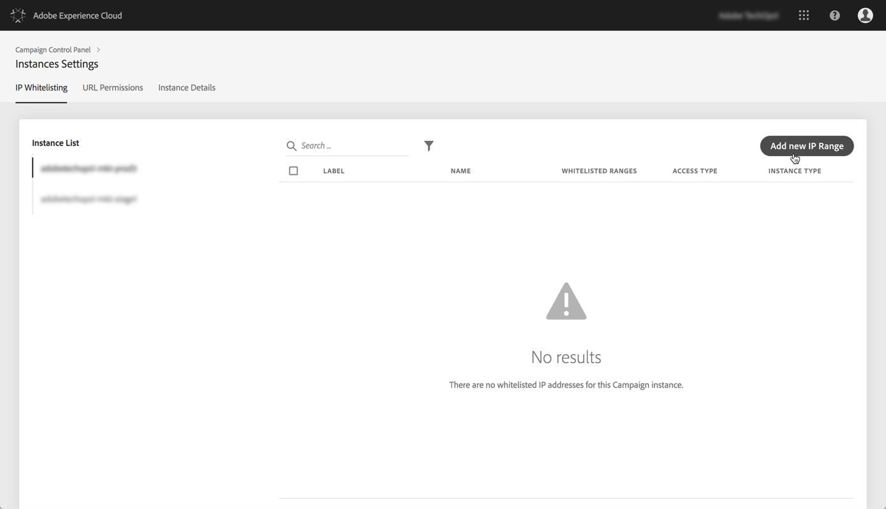
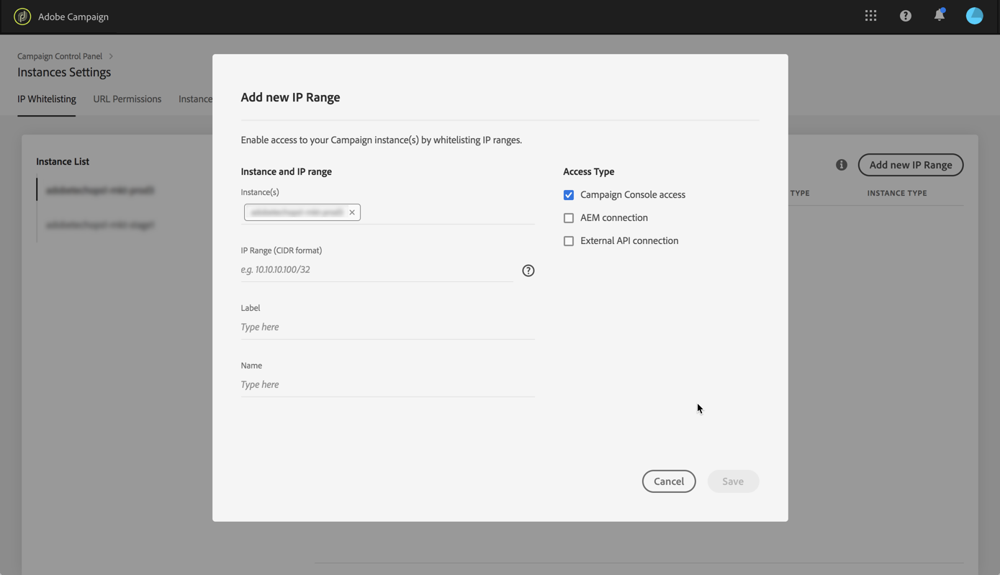
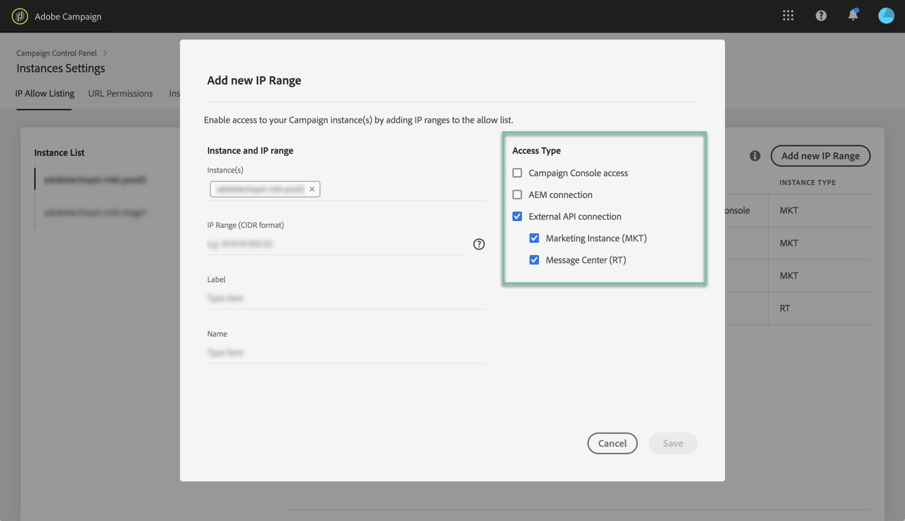
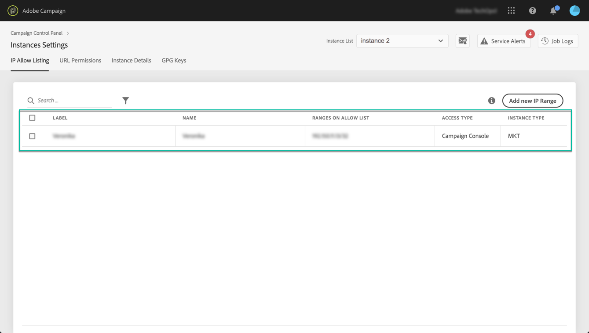

# IP allow listing {#ip-allow-listing}

>[!CONTEXTUALHELP]
>id="cp_instancesettings_iprange"
>title="About IP allow listing"
>abstract="Add IP addresses to the allow list to access your instances."
>additional-url="https://images-tv.adobe.com/mpcv3/045cac99-f948-478e-ae04-f8c161dcb9e2_1568132508.1920x1080at3000_h264.mp4" text="Watch demo video"

>[!IMPORTANT]
>
>This feature is available for Campaign Classic instances only.

## About IP allow listing {#about-ip-allow-listing}

By default, your Adobe Campaign Classic instance is not accessible from various IP addresses.

If your IP address has not been added to the allow list, you will not be able to login to the instance from this address. The same way, you may not be able to connect an API to your Message Center or Marketing instance if the IP address has not been added to the allow list with the instance explicitly.

Control Panel allows you to set up new connections to your instances by adding IP addresses ranges to the allow list. To do this, follow the steps described below.

Once IP addresses are on the allow list, you can create and link Campaign operators to them so that the users can access the instance.

## Best practices {#best-practices}

Make sure you follow the recommendations and limitations below when adding IP addresses to the allow list in the Control Panel.

* **Do not enable IP access to all Access Types** if you do not intend the IP address to connect to your RT servers, or AEM security zone.
* **If you temporarily enabled access to your instance for an IP address**, make sure to remove the IP addresses from the allow list once you don't it need anymore to connect to your instance.
* **We do not recommend adding IP addresses of public places to the allow list** (airports, hotels, etc.). Please use your company VPN address to keep your instance secure at all times.

## Adding IP addresses to the allow list for Instance access {#adding-ip-addresses-allow-list}

>[!CONTEXTUALHELP]
>id="cp_instancesettings_iprange_add"
>title="Add New Ip Range"
>abstract="Define the IP range that you want to add to the allow list to connect to your instance."

To add IP addresses to the allow list, follow these steps:

1. Open the **[!UICONTROL Instances Settings card]** to access the IP allow listing tab, then click **[!UICONTROL Add new IP Range]**.

    >[!NOTE]
    >
    >If the Instance Settings card is not visible on the homepage of the Control Panel, this means your IMS Organization ID is not associated with any Adobe Campaign Classic instances

    

1. Fill in the information for the IP Range that you want to add to the allow list as described below.

    

    * **[!UICONTROL Instance(s)]**: The instances to which the IP addresses will be able to connect. Several instances can be manipulated at the same time. For example, IP allow listing can be performed on both Production and Stage instances through the same step.
    * **[!UICONTROL IP Range]**: The IP range that you want to add to the allow list, in the CIDR format. Note that an IP range cannot overlap an existing range on the allow list. In that case, first delete the range that contains the overlapping IP.

    >[!NOTE]
    >
    >CIDR (Classless Inter-Domain Routing) is the supported format when adding IP ranges with the Control Panel interface. The syntax consists of an IP address, followed by a '/' character, and a decimal number. The format and its syntax are fully detailed in [this article](https://whatismyipaddress.com/cidr).
    >
    >You can search on the internet for free online tools that will help you convert the IP range that you have in hand to CIDR format.

    * **[!UICONTROL Label]**: The label that will display in the allow list.
    * **[!UICONTROL Name]**: The name has to be unique for the Access Type, Instance (in case of External API connection) as well as the IP address.

1. Specify the type of access that you want to grant to the IP addresses:

    * **[!UICONTROL Campaign Console Access]**: The IP addresses will be allowed to connect to the Campaign Classic Console. Note that Console access is enabled for Marketing instances only. Access to MID and RT instance is not permitted and therefore not enabled.
    * **[!UICONTROL AEM connection]**: The specified AEM IP addresses will be allowed to connect to the Marketing instance.
    * **[!UICONTROL External API connection]**: External APIs with the specified IP addresses will be allowed to connect to the Marketing and/or Message Center (RT) instance. Note that connection to the console of RT instances is not enabled.

    

1. Click the **[!UICONTROL Save]** button. The IP Range is added to the allow list.

    

To delete IP ranges from the allow list, select them then click the **[!UICONTROL Delete IP range]** button.

**Related topics:**
* [IP allow listing (tutorial video)](https://docs.adobe.com/content/help/en/campaign-learn/campaign-classic-tutorials/administrating/control-panel-acc/ip-allow-listing.html)
* [Linking a security zone to an operator](https://docs.campaign.adobe.com/doc/AC/en/INS_Additional_configurations_Configuring_Campaign_server.html#Linking_a_security_zone_to_an_operator)
