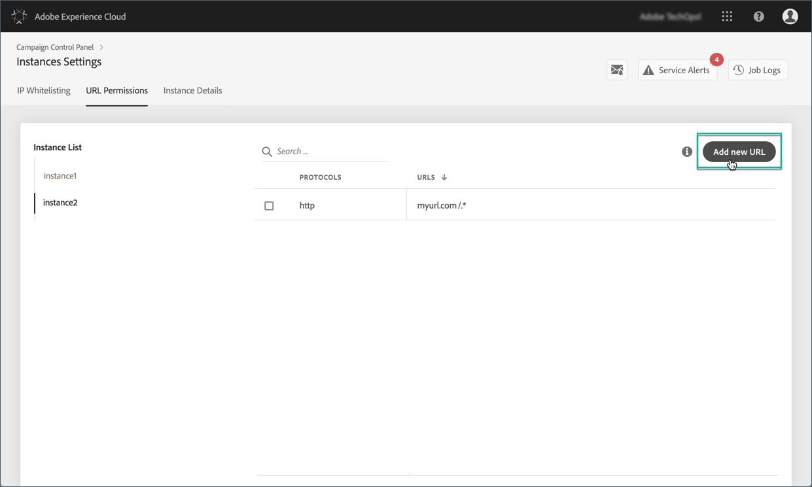
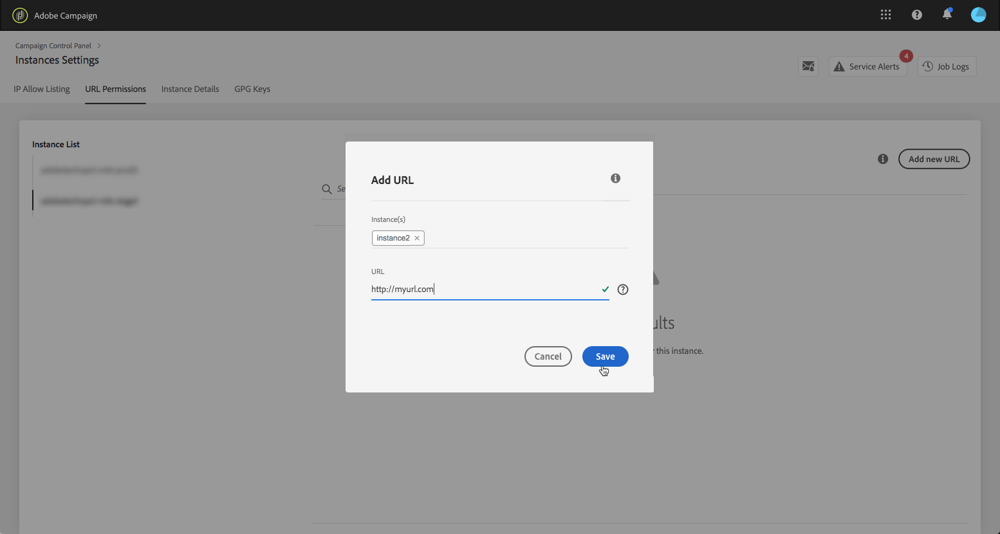
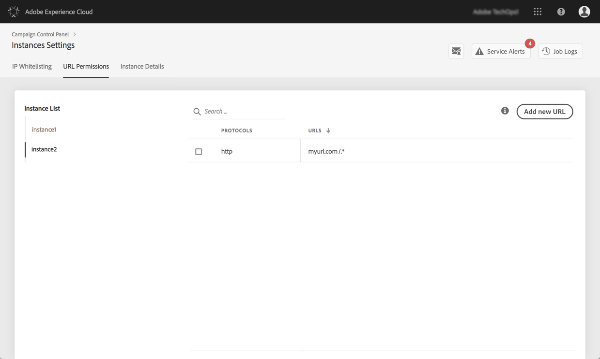

# URL permissions {#url-permissions}

>[!CONTEXTUALHELP]
>id="cp_instancesettings_urlpermissions"
>title="About URL permissions"
>abstract="Manage the URLs that your Adobe Campaign instances can connect to."
>additional-url="https://images-tv.adobe.com/mpcv3/91206a19-d9af-4b6a-8197-0d2810a78941_1563488165.1920x1080at3000_h264.mp4" text="Watch demo video"

>[!IMPORTANT]
>
>This feature is available for Campaign Classic instances only.

## About URL permissions {#about-url-permissions}

The default list of URLs that can be called by JavaScript codes (workflows, etc.) by your Campaign Classic instances is limited. These are URLs that allow your instances to function properly.

By default, instances are not allowed to connect to outside URLs. The Control Panel allows you to add some outside URLs to the list of authorized URLs, so that your instance can connect to them. This allows you to connect your Campaign instances to outside systems like, for example, SFTP servers or websites in order to enable file and/or data transfer.

Once a URL is added, it is referenced in the configuration file of the instance (serverConf.xml).

**Related topics:**

* [Configuring Campaign server](https://docs.campaign.adobe.com/doc/AC/en/INS_Additional_configurations_Configuring_Campaign_server.html)
* [Outgoing connection protection](https://docs.campaign.adobe.com/doc/AC/en/INS_Additional_configurations_Configuring_Campaign_server.html#Outgoing_connection_protection)
* [Adding URL Permissions (tutorial video)](https://docs.adobe.com/content/help/en/campaign-learn/campaign-classic-tutorials/administrating/control-panel-acc/adding-url-permissions.html)

## Best practices {#best-practices}

* Do not connect your Campaign instance to websites/servers that you do not intend to connect to.
* Delete URLs that you are no longer working with. However, be aware that, if another section of your company is still connecting to the URL that you deleted, nobody will be able to use it again.
* The Control Panel supports **http**, **https**, and **sftp** protocols. Entering invalid URLs or protocols will result in errors.

## Managing URL permissions {#managing-url-permissions}

>[!CONTEXTUALHELP]
>id="cp_instancesettings_url_add"
>title="Add new URL"
>abstract="Add URLs to allow connections to your Campaign instance."

To add a URL that your instance can connect to, follow these steps:

1. Open the **[!UICONTROL Instances Settings]** card to access the **[!UICONTROL URL Permissions]** tab.

    >[!NOTE]
    >
    >If the Instance Settings card is not visible on the homepage of the Control Panel, this means your IMS ORG ID is not associated with any Adobe Campaign Classic instances
    >
    >The <b>URL permissions</b> tab lists all outside URLs that your instance can connect to. This list does not include URLs that are required for Campaign to work (e.g., connections between infrastructure pieces).

1. Select in the left pane the desired instance, then click the **[!UICONTROL Add new URL]** button.

    

    >[!NOTE]
    >
    >All your Campaign instances display in the left pane list.
    >
    >As URL Permissions management is dedicated to Campaign Classic instances only, the "Non-Applicable Instance" message displays if you select a Campaign Standard instance.  

1. Type the URL to authorize, with its associated protocol (http, https or sftp).

    >[!NOTE]
    >
    >It is possible to authorize multiple instances to connect to the URL. To do this, add them directly from the Instance(s) field by typing their first letter.

    

1. The URL is added to the list, you can now connect to it.

    >[!NOTE]
    >
    >The "/.*" characters are automatically added to the end of the URL you enter after it has been validated, to cover all sub-pages of the entered page.

    

You can delete a URL at any time by selecting it and clicking the **[!UICONTROL Delete URL]** button.

Keep in mind that, if you delete a URL, your instance will not be able to call it again.

## Common questions {#common-questions}

**I added a new URL, but my instance is still unable to connect to that URL. Why is that?**

In some cases, URLs you try to connect to require whitelisting, password entry or another form of authentication. The Control Panel does not manage additional authentication.
