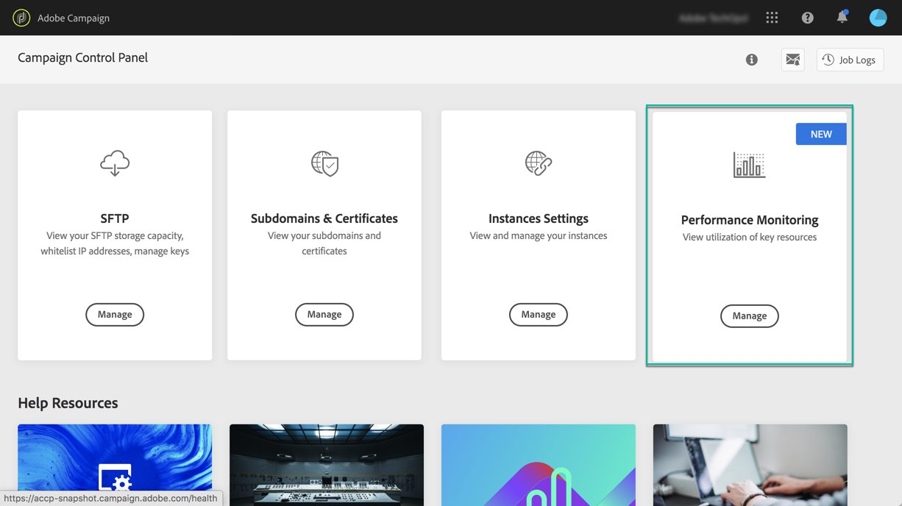
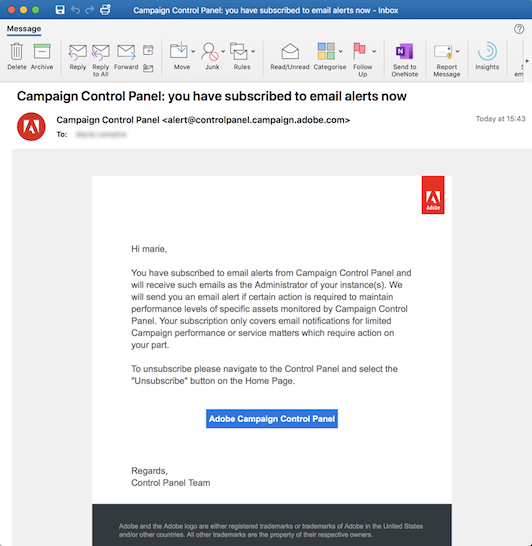

# About performance monitoring {#about-performance-monitoring}

Control Panel provides several functionalities to help you monitor your instances and ensure optimal performances.

The **[!Performance monitoring]** card in the Control Panel home page allows you to monitor the usage of your Campaign instances like, for example, monitoring the database capacity of your instances. For more on this, refer to [this section](../../performance-monitoring/using/database-monitoring.md).

>[!NOTE]
>
>With upcoming Control Panel releases, additional monitoring functionalities will be made available in this card.

Moreover, Control Panel allows you to sign up to receive email notifications each time that an issue is detected on one of your Campaign instances. For more on this, refer to [this section](../../performance-monitoring/using/email-alerting.md)

