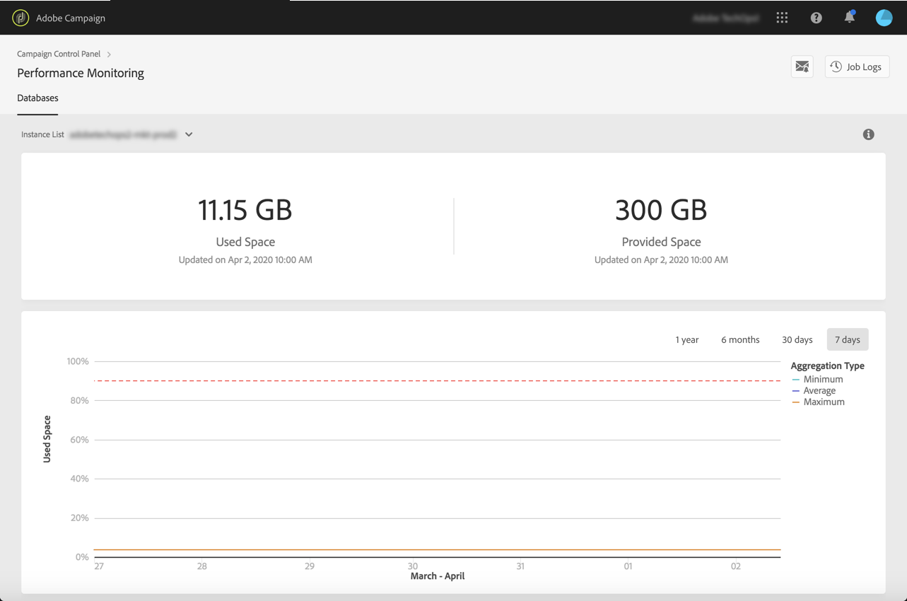
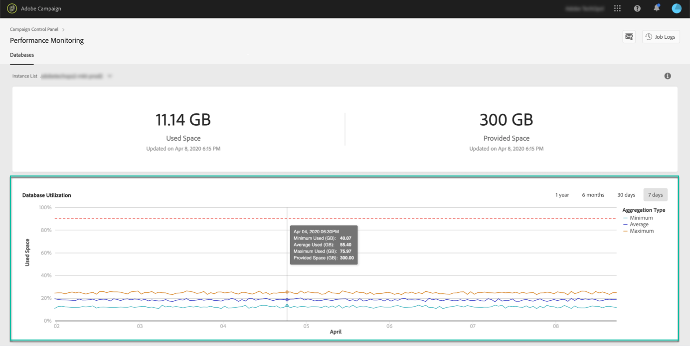

# Database monitoring {#database-monitoring}

>[!IMPORTANT]
>
>Database monitoring from the Control Panel will be available by the end of April.

## About instances databases {#about-instances-databases}

According to your contract, each of your Campaign instances is provisioned with a specific amount of database space.

Databases include all **assets**, **workflows** and **data** that is stored in Adobe Campaign.

Over time, databases can reach their maximum capacity, especially if the stored resources are never deleted from the instance, or if there are many workflows in a paused state.

Overflowing an instance database can lead to several issues (inability to login, to send emails etc.). Monitoring your instances' databases is therefore essential to ensure optimal performance.

>[!NOTE]
>
>The amount of database space provided as shown in the Control Panel may not reflect the amount of Database space specified in your contract. Most often, larger database space is provided to you temporarily to ensure performance of your system.

## Monitoring database usage {#monitoring-instances-database}

Control Panel allows you to monitor the database usage for each of your Campaign instances. To do this, follow the steps below.

1. Open the **[!UICONTROL Performance Monitoring]** card, then select the **[!UICONTROL Databases]** tab.

1. Select the desired instance from the **[!UICONTROL Instance List]**.

    The upper area provides information on the instance's database capacity and used space.

    

    The lower area provides a graphical representation of the minimum, average and maximum database utilization over the last 7 days, as well as the 90% database utilization threshold, represented by a red dotted curve.

    You can change the displayed period of time using the available filters in the upper-right corner.

    For better readability, you can also highlight one or several curves in the graph. To do this, select them from the  **[!UICONTROL Aggregation Type]** legend.

    Hovering over the graph allows you to get detailed information on the selected period of time.

    

>[!NOTE]
>
>Additionally to this dashboard, you can receive notifications when one of your databases is reaching its capacity. To do this, subscribe to [email alerts](../../performance-monitoring/using/email-alerting.md)

## Preventing database overload {#preventing-database-overload}

Campaign Standard and Classic offer various ways of preventing overconsumption of database disk space.

The section below provides useful resources from Campaign documentations to help you optimize your databases usage:

**Workflows monitoring**

* [Workflows best practices](https://docs.adobe.com/content/help/en/campaign-standard/using/managing-processes-and-data/workflow-general-operation/best-practices-workflows.html) (Campaign Standard)
* [Monitoring workflow execution](https://docs.adobe.com/help/en/campaign-classic/using/automating-with-workflows/monitoring-workflows/monitoring-workflow-execution.html) (Campaign Classic)

**Database maintenance**

* Database cleanup technnical workflow ([Campaign Standard](https://docs.adobe.com/help/en/campaign-standard/using/administrating/application-settings/technical-workflows.html#list-of-technical-workflows) / [Campaign Classic](https://docs.adobe.com/help/en/campaign-classic/using/monitoring-campaign-classic/data-processing/database-cleanup-workflow.html))
* [Database maintenance guide](https://docs.adobe.com/content/help/en/campaign-classic/using/monitoring-campaign-classic/database-maintenance/recommendations.html) (Campaign Classic)
* [Database performance troubleshooting](https://docs.adobe.com/content/help/en/campaign-classic/using/monitoring-campaign-classic/troubleshooting/database-performances.html) (Campaign Classic)
* [Database-related options](https://docs.adobe.com/help/en/campaign-classic/using/installing-campaign-classic/appendices/configuring-campaign-options.html#database) (Campaign Classic)
