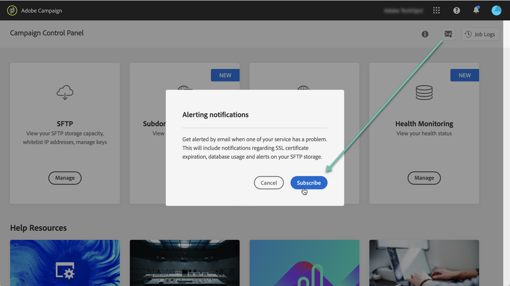

# Email alerting {#email-alerting}

In order to provide greater flexibility to your work, Control Panel is equipped with real-time email alerting functionality.

To subscribe to these alerts follow these steps:

1. Click the **[!UICONTROL Alerting notifications]** button available from any location in the Control Panel.

1. Click **[!UICONTROL Subscribe]**. An email is sent to confirm your subscription.

>[!NOTE]
>
>You can sign out from email alerts at any time using the **[!UICONTROL Alerting notifications]** button.

After subscribing, Control Panel will notify about system issues and recommend the actions to take.

Email alerts are sent to everyone who has signed up for **all instances** that they are Administrators of.

The list of alerts is as follows:

* **SFTP storage usage**: One of your SFTP servers has reached 80% or more of its capacity. See [SFTP storage management](../../sftp/using/sftp-storage-management.md).

* **Database usage**: One of your instances' databases has reached 80% or more of its capacity. See [Database monitoring](../../performance-monitoring/using/database-monitoring.md).

* **SSL certificate expiration**: One of your subdomains' SSL certificates has expired or is going to expire in  60 days or less. See [Monitoring subdomains' SSL certificates](../../subdomains-certificates/using/monitoring-ssl-certificates.md).
