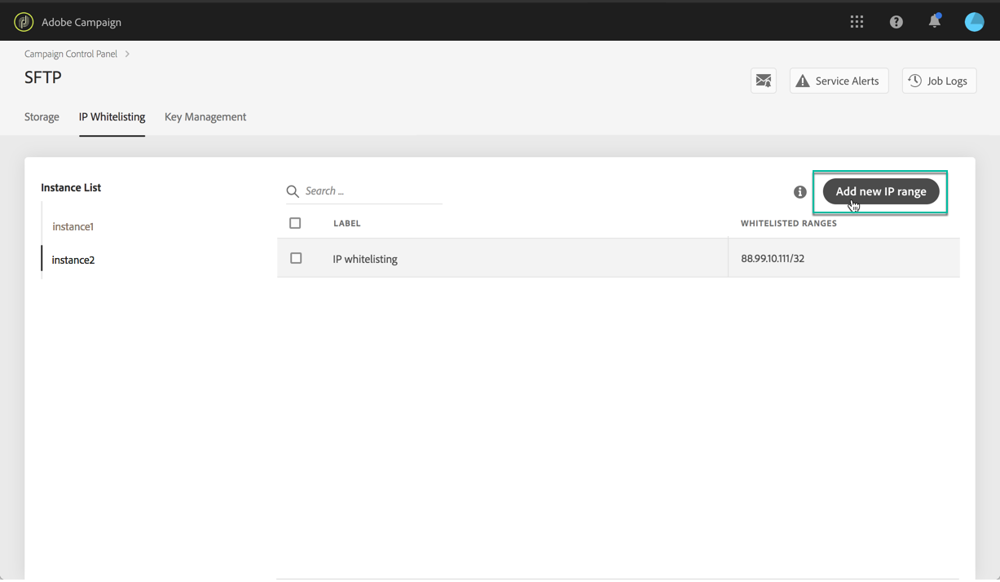
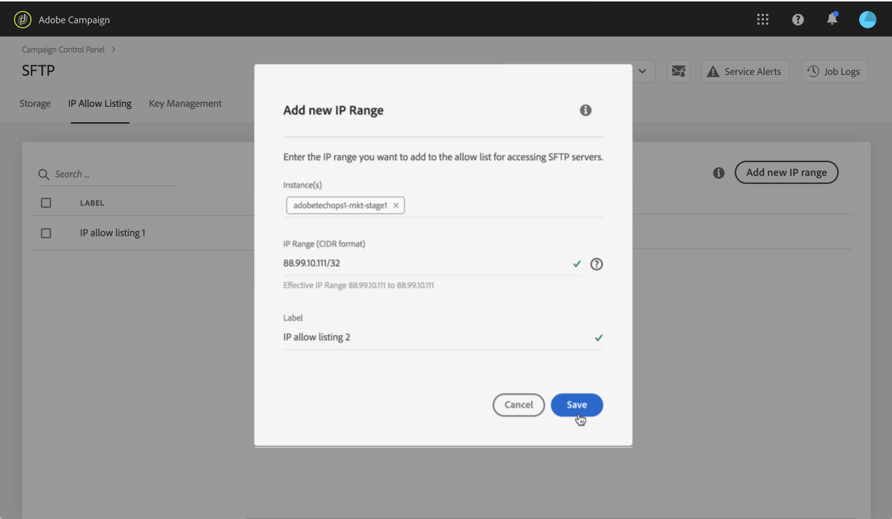
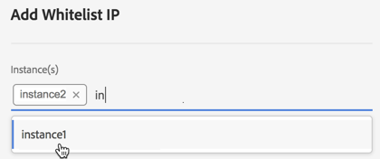
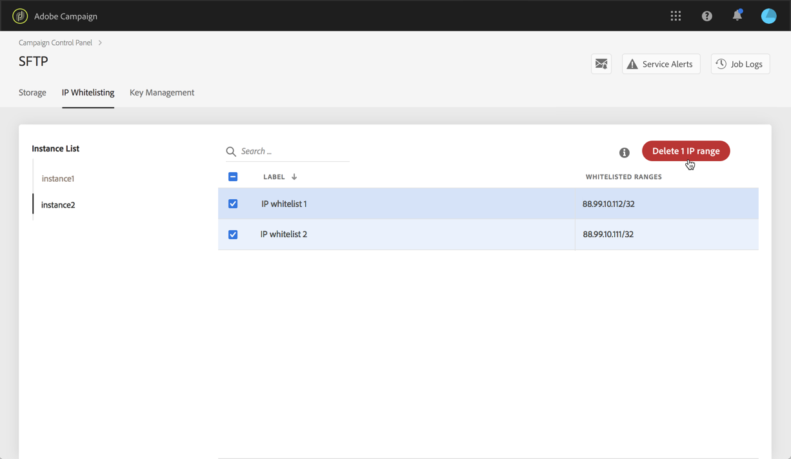

# IP range whitelisting {#ip-range-whitelisting}

SFTP servers are protected. In order to be able to access them in order to view files or write new ones, you need to whitelist the public IP address of the system or client that accesses the servers.

## About the CIDR format {#about-cidr-format}

CIDR (Classless Inter-Domain Routing) is the supported format when adding IP ranges with the Control Panel interface.

The syntax consists of an IP address, followed by a '/' character, and a decimal number. The format and its syntax are fully detailed in [this article](https://whatismyipaddress.com/cidr).

You can search on the internet for free online tools that will help you convert the IP range that you have in hand to CIDR format.

## Best practices {#best-practices}

Make sure you follow the recommendations and limitations below when whitelisting IP addresses in the Control Panel.

* **Whitelist IP ranges** rather than single IP addresses. To whitelist a single IP address, append a '/32' to it to indicate that the range only includes a single IP.
* **Do not whitelist very wide ranges**, for example including > 265 IP addresses. The Control Panel will reject any CIDR-format ranges that are between /0 and /23.
* Only **public IP addresses** can be whitelisted.
* Make sure to **regularly delete whitelisted IP addresses** that you don't need anymore.

## Whitelisting IP addresses {#whitelisting-ip-addresses}

To whitelist an IP range, follow these steps:

1. Open the **[!UICONTROL SFTP]** card, then select the **[!UICONTROL IP Whistelisting]** tab.
1. The list of whitelisted IP addresses displays for each instance. Select the desired instance from the left-hand side list, then click the **[!UICONTROL Add new IP range]** button.

    

1. Define the IP Range that you want to whitelist, in the CIDR format, then define the label that will display in the list.

    >[!NOTE]
    >
    These special characters are allowed in the Label field:
    > `. _ - : / ( ) # , @ [ ] + = & ; { } ! $`

    

    >[CAUTION]
    >
    >An IP range cannot overlap an existing whitelisted range. In that case, first delete the range that contains the overlapping IP.

    It is possible to whitelist a range for multiple instances. To do this, press the down arrow key or type the first letters of the desired instance, then select it from the suggestions list.

    

1. Click the **[!UICONTROL Save]** button. IP whitelist addition will be displayed as PENDING until the request is fully processed. This should only take a few seconds.

To delete whitelisted IP ranges, select them then click the **[!UICONTROL Delete IP range]** button.

>[!NOTE]
>
It is currently not possible to edit a whitelisted range. To modify an IP range, delete it, then create a one corresponding to your needs.

## Monitoring changes {#monitoring-changes}

The **[!UICONTROL Job Logs]** in the Control Panel home page let you monitor all changes that have been made to whitelisted IP addresses.

For more on the Control Panel interface, refer to [this section](../../discover/using/discovering-the-interface.md).

