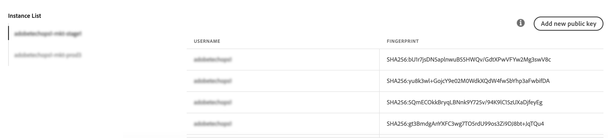
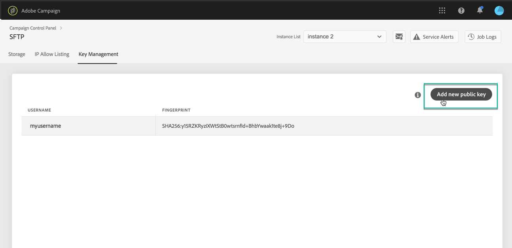
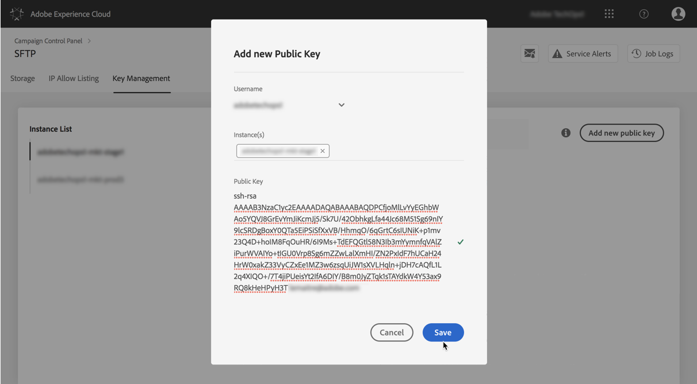
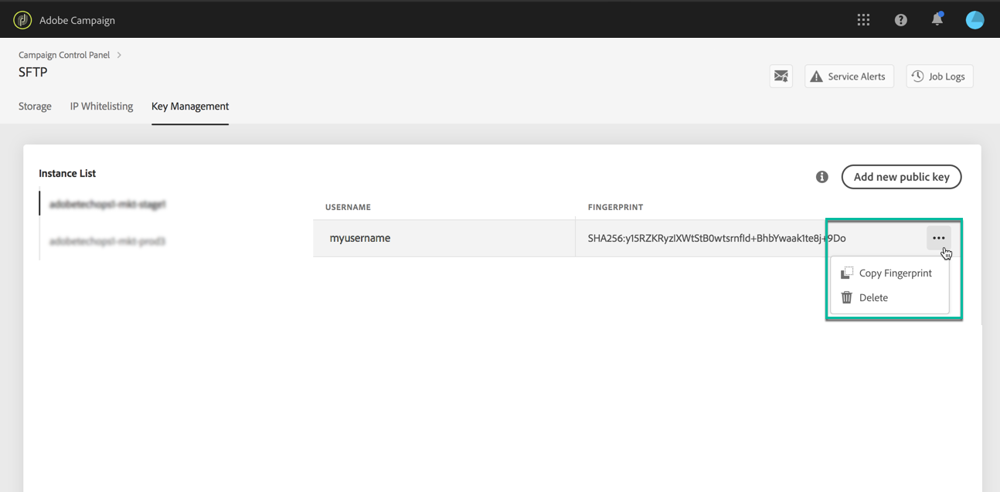

# Key management {#key-management}

Adobe recommends that all customers establish connection to their SFTP servers with a **public and private key pair**.

The steps to generate a public SSH key and add it to access the SFTP server are decribed below, as well as recommendations regarding  authentication.

Once access to the server is set up, remember to **whitelist the IP addresses** that will require access to the server so that you can connect to it. For more on this, refer to [this section](../../instances-settings/using/ip-whitelisting-instance-access.md).

>[!NOTE]
>
>It is currently not possible to delete a SSH public key.

## Best practices {#best-practices}

**About the public SSH key**

Make sure you always use the same authentication to connect to the server, and you are using a supported format for the key.

**API integration with username and password**

In very rare cases password based authentication is enabled on some SFTP servers. Adobe recommends that you use key based authentication, as this method is more efficient and secure. You can request to switch to key based authentication by contacting Customer Care.

>[!CAUTION]
>
>If you password expires, even if there are keys installed on your system, you will not be able to login to your SFTP accounts.

## Installing the SSH key {#installing-ssh-key}

>[!CAUTION]
>
>The steps below are an example of SSH key creation only, please follow your organization guidelines with respect to SSH keys. The example below is just one example of how this can be done and serves as a helpful point of reference for communicating requirements to your team or internal network group.

1. Navigate to the **[!UICONTROL Key Management]** tab, then click the **[!UICONTROL Add public key]** button.

    

1. In the dialog box that opens, select the username that you want to create the public key for, and the server for which you want to activate the key.

    >[!NOTE]
    >
    >The interface will check if a given username is active on a given instance and give you an option to activate the key on one or several instances.
    >
    >One or more public SSH keys can be added for each user.

    

1. Copy-paste the public SSH key. To generate a public key, follow the steps below corresponding to your operating system:

    >[!NOTE]
    >
    >The public SSH key size should be **2048 bits**.

    **Linux and Mac:**

    Use the Terminal to generate a public and private key pair:
    1. Enter this command: `ssh-keygen -t rsa -C <your_email@example.com>`.
    1. Provide a name to your key when prompted. If the .ssh directory does not exist, the system will create one for you.
    1. Enter, then re-enter, a passphrase when prompted. It can also be left blank.
    1. A key pair "name" and "name.pub" is created by the system. Search for the "name.pub" file, then open it. It should have alpha-numeric string ending with the email address that you specified.

    **Windows:**

    You might need to install a third party tool that will help you generate private/public key pair in the same format "name.pub".

1. Open the .pub file, then copy-paste the whole string starting with "ssh..." into Control Panel.

    

1. Click the **[!UICONTROL Save]** button to create the key. Control Panel saves the Public key and its associated Fingerprint, encrypted with the SHA256 format.

You can use fingerprints to match the Private keys that are saved on your computer with the corresponding Public keys saved in Control Panel.

The "**...**" button allows you to delete an existing key, or to copy its associated fingerprint into your clipboard.

