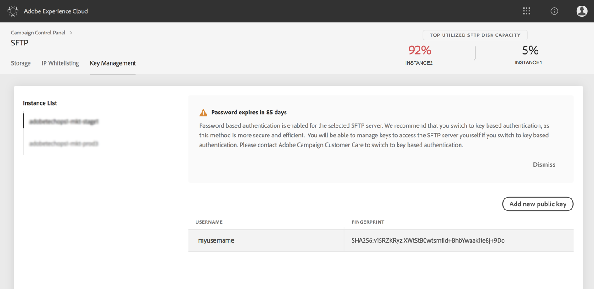
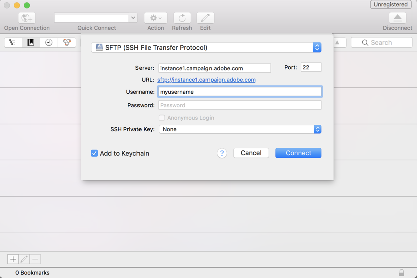
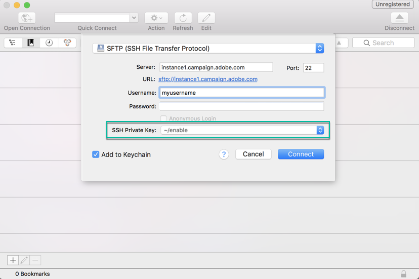
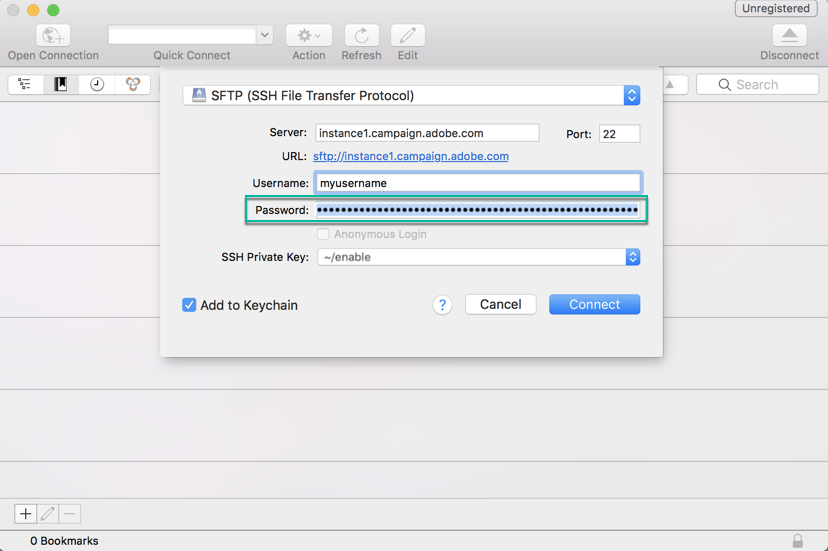

# Logging into your SFTP server {logging-into-sft-server}

The steps below detail how to connect your SFTP server through your SFTP client application.

Before logging in to the server, make sure that:

* Your SFTP server is **hosted by Adobe**.
* Your **username** has been setup for the server. You can check this information directly in Control Panel, in the **Key management** tab from the SFTP Card.
* You have a **private and public key pair** to login to the SFTP server. Refer to [this section](../../sftp/using/key-management.md) for more on how to add the SSH key.
* Your **public IP address has been whitelisted** on the SFTP server. If not, refer to [this section](../../sftp/using/ip-range-whitelisting.md) for more on how to whitelist your IP range.
* You have an access to a **SFTP client software**. You can consult your IT department for SFTP client application that they recommend to use, or search for one on the internet if this is allowed by your company policies.

To connect to your SFTP server, follow these steps:

1. Launch Control Panel, then select the **[!UICONTROL Key Management]** tab from the **[!UICONTROL SFTP]** card.

    

1. Launch your SFTP client application, then copy-paste the server address from Control Panel, followed by "campaign.adobe.com", then fill in your username.

    

1. In the **[!UICONTROL SSH Private Key]** field, select the private key file stored in your computer. It corresponds to a text file that has the same name as your public key, without the ".pub" extension (e.g., "enable").

    

    The **[!UICONTROL Password]** field is automatically filled in with the private key from the file.

    

    You can check that the key you are trying to use is saved in the Control Panel by comparing the fingerprint of the private or public key with the fingerprint of the keys appearing in the SFTP card's Key Management tab.

    

    >[!NOTE]
    >
    >If you are using a Mac computer, you can view the fingerprint of the private key stored in your computer by running this command:
    >
    >`ssh-keygen -lf <path of the privatekey>`

1. Once all the information filled in, click **[!UICONTROL Connect]** to log in to your SFTP server.

    
