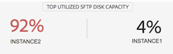

# SFTP storage management {#sftp-storage-management}

You may have different storage capacity provisioned on your SFTP server, depending on your contractual terms.

It is essential that you regularly monitor available space for each of your SFTP servers. Otherwise, you may not be able to save any additional files on the server anymore, or to successfully execute workflows that rely on the updates from this server.

**Related topics:**

* [Campaign Standard tutorial video](https://docs.adobe.com/content/help/en/campaign-learn/campaign-standard-tutorials/administrating/control-panel/managing-sftp-servers.html)
* [Campaign Classic tutorial video](https://docs.adobe.com/content/help/en/campaign-learn/campaign-classic-tutorials/administrating/control-panel-acc/cp-managing-sftp-servers.html)

## Accessing storage capacity information {#accessing-storage-capacity-information}

The **[!UICONTROL Top utilized SFTP disk capacity]** section in the header includes the top three most utilized servers attached to the instances that you have Admin access to. This information is available in every tab of the SFTP card.

Information about the space used by all instances you have access to is available in the **[!UICONTROL Storage]** tab of the SFTP card. It is updated on each page refresh.

For each instance, a visual alert lets you know when its storage surpasses its capacity:

* **Orange**: the instance surpassed 80% of its capacity,
* **Red**: the instance surpasses 90% of its capacity.

Additional tips are also available to help you know how to proceed as your server approaches its capacity.

## Best practices when the storage capacity runs out {#best-practices-when-capacity-runs-out}

1. **Clean the SFTP server from old or unnecessary files**. For more on how to access your SFTP server folder, refer to [this section](../../sftp/using/logging-into-sftp-server.md).
1. Ensure that the **workflows** that clean your SFTP servers are successfully executing. For more on technical workflows in Adobe Campaign, refer to the dedicated [Campaign Classic](https://docs.campaign.adobe.com/doc/AC/en/WKF__General_operation_Building_a_workflow.html#Technical_workflows) and [Campaign Standard](https://helpx.adobe.com/campaign/standard/administration/using/technical-workflows.html) documentations.
1. Reach out to your account team to **request more storage** (additional charges may apply).
1. Reach out to **Customer Care** if you believe there is an issue.
