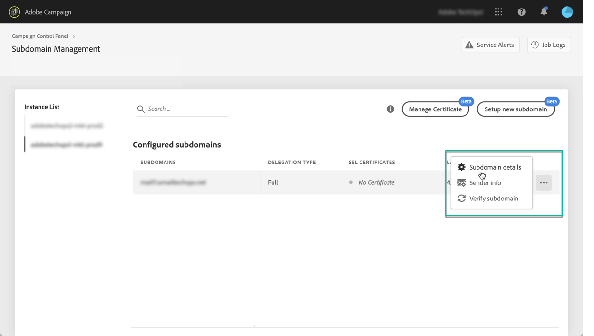
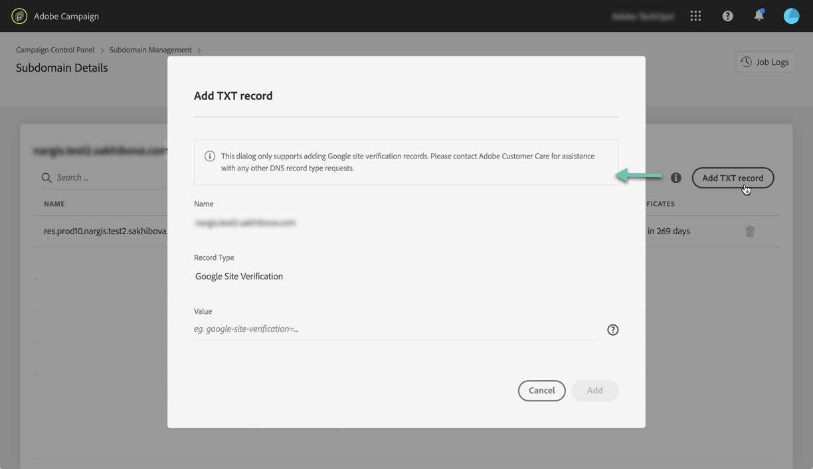
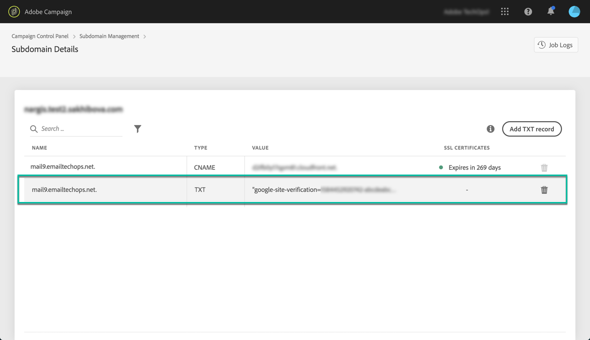

# Managing TXT records {#managing-txt-records}

>[!CONTEXTUALHELP]
>id="cp_siteverification_add"
>title="Managing TXT records"
>abstract="Some services like Google require that you add a TXT record to your domain settings in order to verify that you own the domain."

## About TXT records {#about-txt-records}

TXT records are a type of DNS records used to provide text information about a domain, that can be read by external sources.

In order to ensure high inbox rates, and low spam rates, some services like Google require that you add a TXT record to your domain settings in order to verify that you own the domain.

Currently, Gmail is among one of the most popular email addresses providers. In order to ensure good deliverability and successful delivery of emails to Gmail addresses, Adobe Campaign allows you to add special Google site verification TXT records to your subdomains to ensure that it is verified.

Additional resources:

* [Campaign Standard tutorial video](https://docs.adobe.com/content/help/en/campaign-standard-learn/tutorials/administrating/control-panel/google-txt-record-management.html)
* [Campaign Classic tutorial video](https://docs.adobe.com/content/help/en/campaign-classic-learn/tutorials/administrating/control-panel-acc/google-txt-record-management.html)

## Adding a Google TXT record for a subdomain {#adding-a-google-txt-record}

To add a Google TXT record to your subdomain used to email Gmail addresses, follow these steps:

1. Navigate to the **[!UICONTROL Subdomain and Certificates]** card.

1. Select your instance, then open the details of the subdomain to which you would like to add a DNS record.

    

1. Click the **[!UICONTROL Add TXT record]** button, then enter the value generated in G Suite Admin tools. For more on this, refer to the [G Suite Admin Help](https://support.google.com/a/answer/183895).

    

1. Click the **[!UICONTROL Add]** button to confirm.

    

Once the TXT record is added, you need to have it verified by Google. To do this, navigate to the G Suite Admin tools then launch the verification step (see [G Suite Admin Help](https://support.google.com/a/answer/183895)).

To delete a record, select it from the records list, then click the remove button.

>[!NOTE]
>
>The only record that you can delete from the DNS records list is the one that you have previously added (in our case the Google TXT record).

