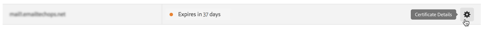
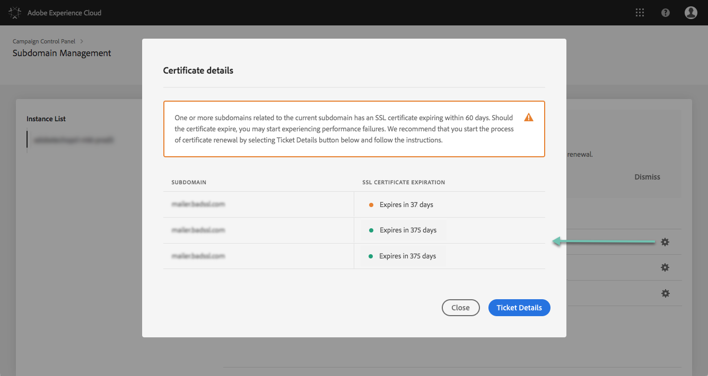

# Monitoring subdomains' SSL certificates {#monitoring-ssl-certificates}

Adobe Campaign recommends that you secure the subdomains that host your landing pages, especially those that are gathering sensitive information of your customers.

**SSL (Secure Socket Layer) encryption** ensures that the subdomains that you delegated to Adobe are secure. When your customer fills out a web form or visits a landing page hosted by Adobe Campaign, by default the information is sent over non-secure protocol (HTTP). To ensure additional security, secure sent information with a HTTPS protocol. For example, your "http://info.mywebsite.com/" subdomain address will now be "https://info.mywebsite.com/".

**SSL certificates are not installed on the delegated subdomains themselves**. They are installed on associated subdomains, mainly those that host landing pages, resource pages and others.

**SSL certificates are provided for a specific period of time** (1 year, 60 days, etc.). Once a certificate expires, you may experience issues when accessing the landing pages or using resources from the subdomain. To prevent this, the Control Panel allows you to monitor your subdomains' SSL certificates, as well as initiate their renewal process.

More details on subdomain delegation is available [here](https://helpx.adobe.com/campaign/kb/domain-name-delegation.html).

The **[!UICONTROL Subdomains and Certificates]** card allows you to see which ones of your subdomains and associated subdomains hosting your landing pages and resources with SSL certificates installed on them.

You can also easily see which subdomains have expiring certificates and renew them if necessary.

>[!NOTE]
>
>Adobe recommends that you renew an SSL certificate of the associated subdomains **when it is close to the expiration date**. Certificate renewal can take a few days depending on your organization, we recommend that you allocate appropriate time for this process.
<!-- note to remove? immediate, no more delay? -->

The list of subdomains for each of your instances is accessible directly when selecting the **[!UICONTROL Subdomains & Certificates]** card.

Subdomains are arranged by the closest expiration date of the SSL certificate, with visual information on the expiration, in days:

* **Green**: the subdomain has not certificate expiring within the next 60 days.
* **Orange**: one or more subdomains has a certificate that will expire within the next 60 days.
* **Red**: one or more subdomains has a certificate that will expire within the next 30 days.

To get more details on a subdomain's certificates, click the **[!UICONTROL Certificate Details]** button.

The list of all related subdomains will be displayed on their certificates. It typically includes subdomains of landing pages, resource pages, etc.

