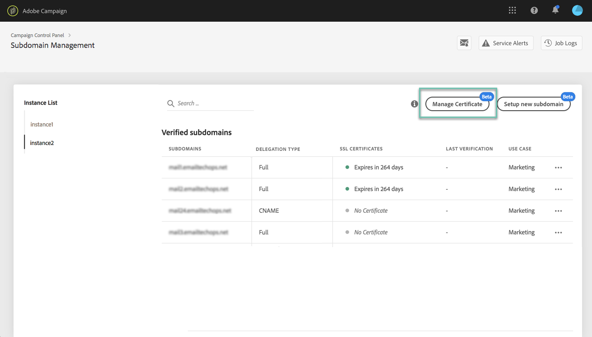
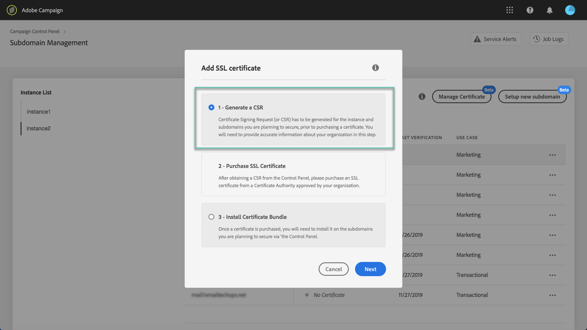
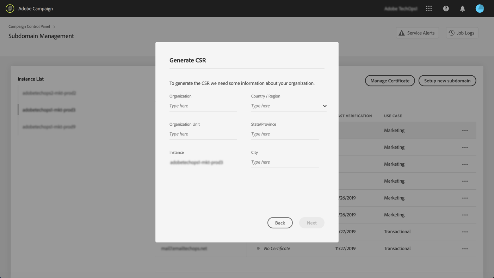
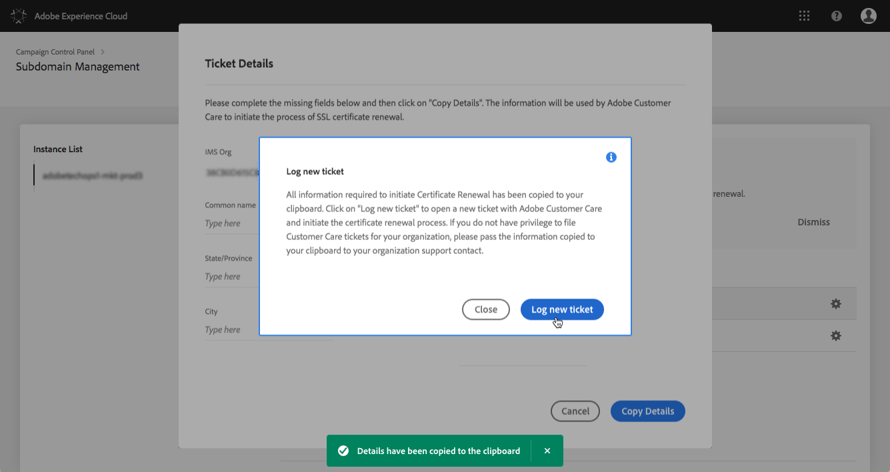
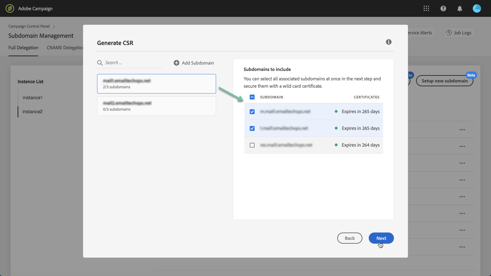
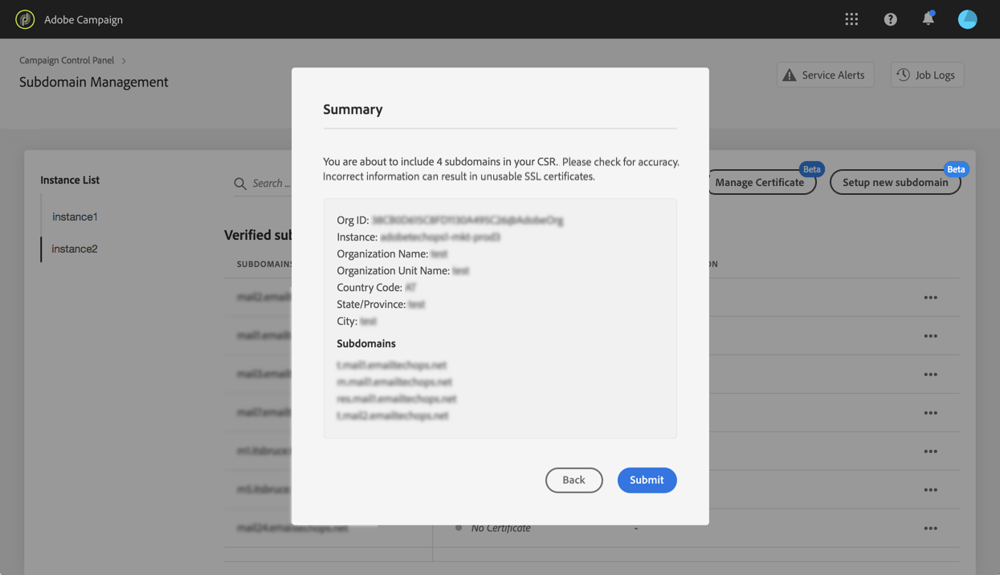
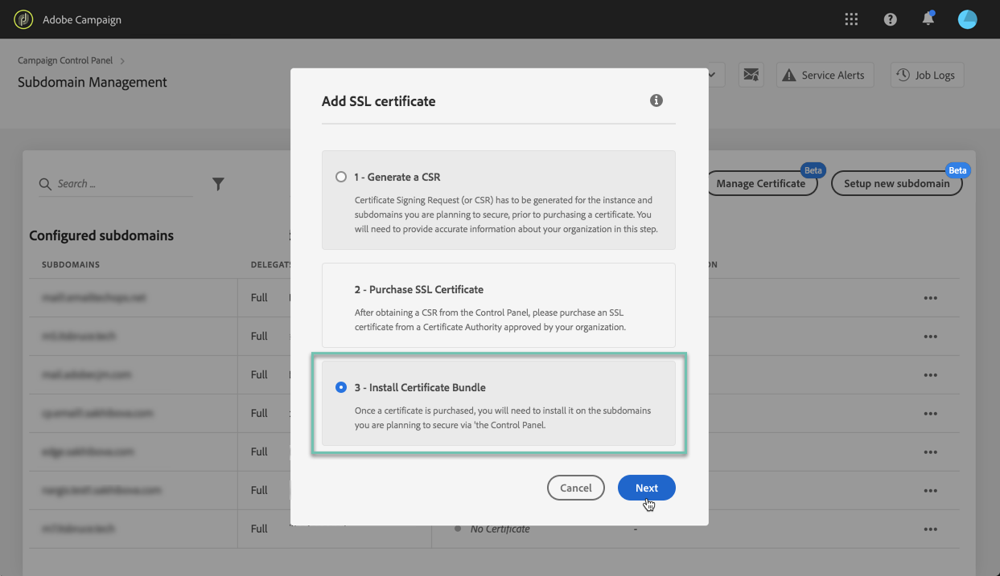
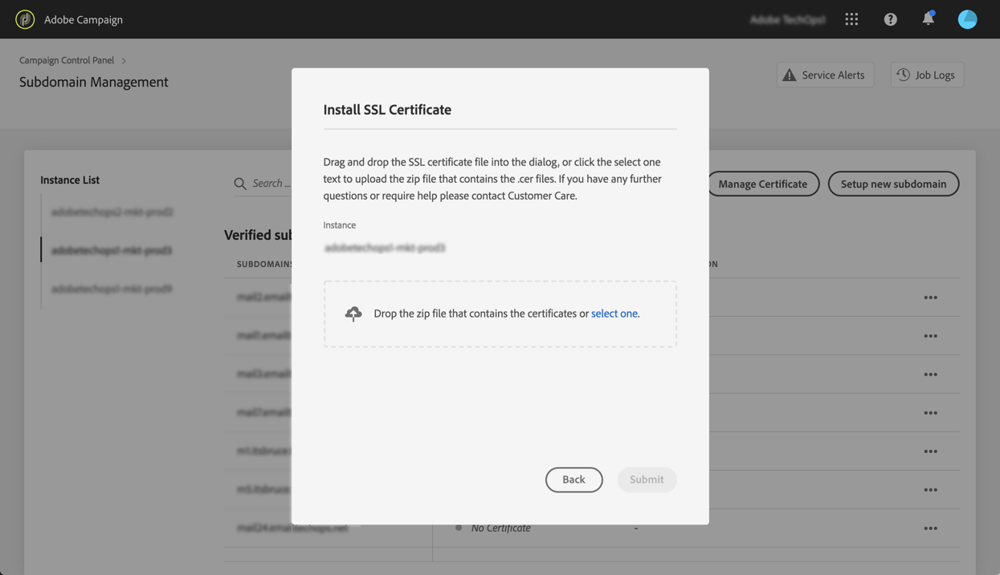

# Renewing a subdomain's SSL certificate {#renewing-subdomains-ssl-certificates}

## About the certificates renewal process {#about-certificate-renewal-process}

The SSL certificate renewal process includes 3 steps, which are all performed directly from the Control Panel:

1. **Generation of the Certificate Signing Request (CSR)**
    Adobe Customer Care generates a CSR for you. You will need to provide some information required to generate the CSR (such as Common Name, Organization Name and address, etc.).
1. **Purchase of the SSL certificate**
    Once the CSR is generated, you can download it and use it to purchase the SSL certificate from the Certificate Authority that your company approves.
1. **Installation of the SSL certificate**
    Once you purchase the SSL certificate, you can install it on the desired subdomain.

### Generating a Certificate Signing Request (CSR) {#generating-csr}

To generate a Certificate Signing Request (CSR), follow these steps:

1. In the **[!UICONTROL Subdomains & Certificates]** card, select the desired instance, then click the **[!UICONTROL Manage Certificate]** button.

    

1. Click **[!UICONTROL Generate a CSR]**, then **[!UICONTROL Next]** to launch the wizard that will guide you through the CSR generation process.

    

1. A form displays, with all the details required to generate your CSR.

    Make sure you fill in the requested information fully and accurately (contact your internal team, Security and IT teams if necessary), then click **[!UICONTROL Next]**.

    * **[!UICONTROL Organization]**:
    * **[!UICONTROL Organization Unit]**:
    * **[!UICONTROL Instance]**: URL of the selected Campaign instance.
    * **[!UICONTROL Country / Region]**
    * **[!UICONTROL State / Province]**
    * **[!UICONTROL City]**

    

1. Select the subdomains to include into the CSR, then click **[!UICONTROL OK]**.

    

1. The selected subdomains display in the list. For each of them, select the subdomains to include, then click **[!UICONTROL Next]**.

    

1. A summary of the subdomains to include in the CSR displays. Click **[!UICONTROL Submit]** to confirm your request.

    

1. The .csr file corresponding to your selection is automatically generated and downloaded. You can now use it to purchase the SSL certificate from the Certificate Authority that your company approves.

## Installing an SSL certificate {#installing-ssl-certificate}

Once an SSL certificazte has been purchased, follow the steps below to install it on your instance.

1. In the **[!UICONTROL Subdomains & Certificates]** card, select the desired instance, then click the **[!UICONTROL Manage Certificate]** button.

    

1. Click **[!UICONTROL Install SSL Certificate]**, then **[!UICONTROL Next]** to launch the wizard that will guide you through the certificate installation process.

    

1. Select the .zip file that contains the certificate to install, then click **[!UICONTORL Submit]**.

    

1. Once the certificate is submitted, the installation process begins. You can follow its progression in the **[!UICONTROL Processing]** section from the subdomains list.

    To retrieve more details, click the **[!UICONTROL Process details]** button.

    

**Related topics:**

* [Campaign Standard tutorial video](https://docs.adobe.com/content/help/en/campaign-learn/campaign-standard-tutorials/administrating/control-panel/managing-ssl-certificates.html)
* [Campaign Classic tutorial video](https://docs.adobe.com/content/help/en/campaign-learn/campaign-classic-tutorials/administrating/control-panel-acc/managing-ssl-certificates.html)
