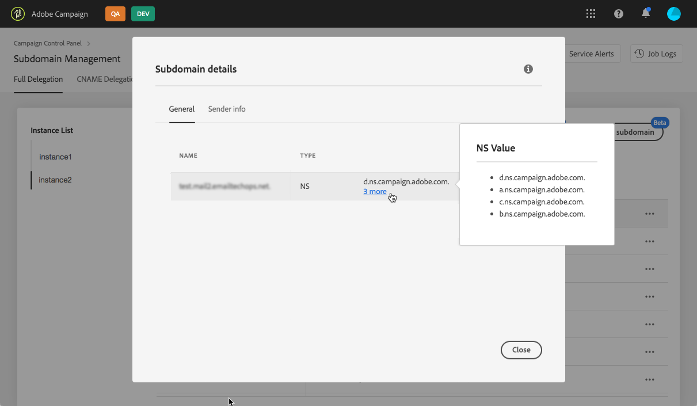
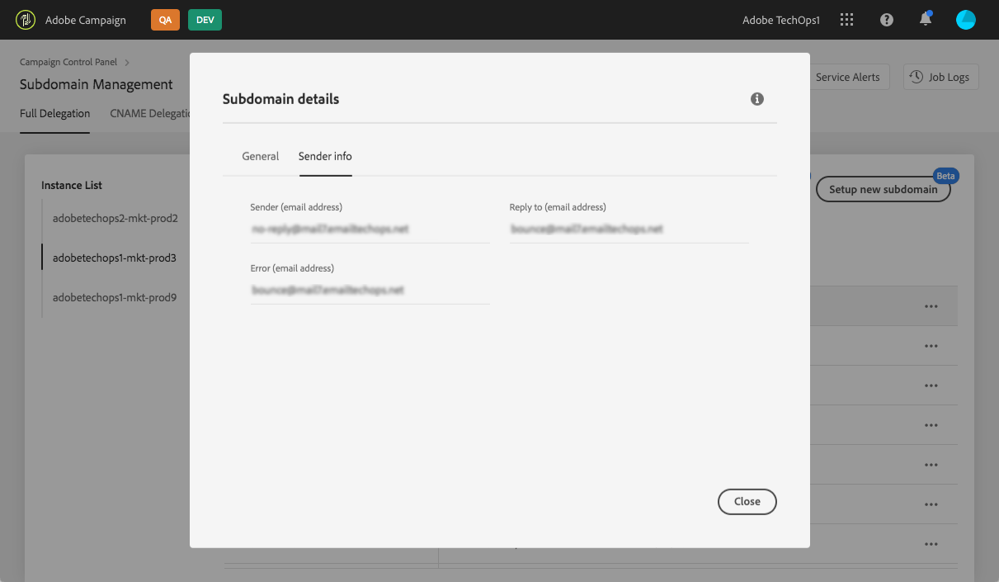

# Setting up a new subdomain {#setting-up-subdomain}

>[!IMPORTANT]
>
>Subdomain delegation from the Control Panel will be available in beta by the end of January, and subject to frequent updates and modifications without notice.

If you have any question regardin subdomain delegation methods, reach out to Adobe Deliverability team, or eventually contact Customer Care to request Deliverability consulting.

## Full subdomain delegation {#full-subdomain-delegation}

Control Panel allows you to fully delegate a subdomain to Adobe Campaign. To do this, follow the steps below.

 >[!NOTE]
 >
 >If the selected instance has no previously configured subdomains, the first subdomain delegated to Adobe will become the **primary subdomain** for that instance, you will not be able to change it in the future.
 >
 >Reverse DNS records will be created for other subdomains using the primary subdomain. Reply-to, and bounce addresses for other subdomains will be generated from the primary subdomain.

1. In the **[!UICONTROL Subdomains & Certificates]** card, select the desired production instance, then click **[!UICONTROL Setup new subdomain]**.

    

    >[!NOTE]
    >
    >Subdomain delegation is available for **production** instances only.

1. Click **[!UICONTROL Next]** to confirm the full delegation method.

    

    >[!NOTE]
    >
    >[CNAME](#use-cnames) and custom methods are currently not supported by the Control Panel.

1. Create the desired subdomain and nameservers in the hosting solution used by your organization. To do this, copy-paste the Adobe Nameserver information displayed in the wizard. For more on how to create a subdomain in a hosting solution, refer to the [tutorial video](https://video.tv.adobe.com/v/30175).

    >[!CAUTION]
    >
    >When configuring nameservers, make sure you **never delegate your root subdomain to Adobe**. Otherwise, the domain will be able to work with Adobe only. Any other use will be impossible, like for example sending internal emails to your organization's employees.

    

    Once the subdomain is created with the corresponding Adobe nameserver information, click **[!UICONTROL Next]**.

1. Select the desired use case for the subdomain:

    * **Marketing communications**: communications that are intended for a commercial purpose. Example: sales email campaign.
    * **Transactional & operational communications**: transactional communications contain information aimed at completing a process that the recipient has started with you. Example: purchase confirmation, password reset email. Organizational communications relate to the exchange of information, ideas, and views within and outside the organization, with no commercial purpose.

    >[!NOTE]
    >
    >Breaking down your subdomains according to use cases is a best practice for deliverability. By doing so, the reputation of each subdomain is isolated and protected.
    >
    >For example, if your subdomain for marketing communications ends up being blacklisted by Internet Service Providers, your transactional communications subdomain will not be impacted, and will keep being able to send communications.

    

1. Enter the subdomain that you created into your hosting solution, then click **[!UICONTROL Submit]**.

    >[!NOTE]
    >
    > Make sure you fill in the **full name** of the subdomain to delegate. For example, to delegate the "usoffers.email.weretail.com" subdomain, type "usoffers.email.weretail.com".

    

1. Once the subdomain is submitted, the Control Panel will check that it correctly point to Adobe NS records and that the Start of Authority (SOA) record does not exist for this subdomain.

1. If the checks are successful, the Control Panel will start setting up the subdomain with DNS records, additional URLs, inboxes etc. You can get more details on the configuration progress by clicking the **[!UICONTROL Process details]** button.

    

    >[!NOTE]
    >
    >In some cases, delegation goes through, but the subdomain may not be successfully verified. The subdomain will go directly into the **[!UICONTROL Verified subdomains]** list with the **[!UICONTROL Unverified]** status and a job log providing information on the error. Contact Customer Care if you have trouble resolving the issue.
    >
    >Note that while subdomain delegation runs, other requests through the Control Panel will be entered into a queue and performed only after the Subdomain Delegation completes, to prevent any performance issues.

At the end of the process, the subdomains will be configured to work with your Adobe Campaign instance and the elements below will be created:

* **The subdomain** with the following **DNS records**: SOA, MX, CNAME(s), DKIM, SPF, TXT,
* **Additional subdomains** to host mirror, resource, tracking pages and domain key,
* **Inboxes**: Sender, Error, Reply-to.

 >[!NOTE]
 >
 >By default, the "Reply-to" inbox from the Control Panel is configured to clear emails and is not reviewable. If you want to monitor your "Reply-to" inbox for your marketing campaigns, do not use this address.

You can get more details on the subdomain by clicking the **[!UICONTROL Subdomain Details]** button.

>[!NOTE]
>
>Additionally to the processing stage, Adobe will notify the deliverability team about the new subdomain in order to audit the subdomain that has been created. The audit process can take up to 3 days after the subdomain has been delegated.
>
>The checks that are performed include feedback loops and spam complaint loops testing. We therefore do not recommend using the subdomain before the audit has been completed, as it could result in bad subdomain reputation.

## Use of CNAMEs {#use-cnames}

The use of CNAMEs for subdomain delegation is not supported through the Control Panel. To use this method, contact Adobe Customer Care.
